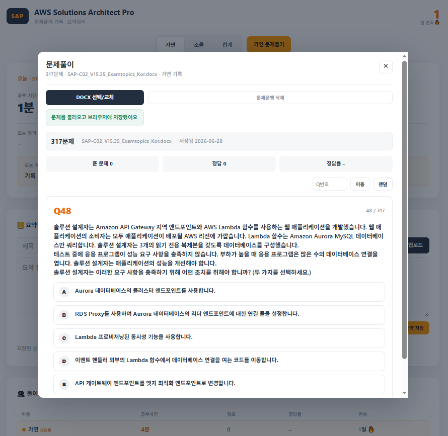

# AWS SAP 스터디 트래커

### https://silano08.github.io/sap-assap-gang/

AWS Solutions Architect Professional 덤프 풀이와 요약정리를 관리하는 정적 웹앱입니다.

## 화면 미리보기



## 쓰는 법

1. `가연` 또는 `소울` 탭을 고릅니다.
2. **문제풀기** 버튼을 누릅니다.
3. 모달에서 각자 가지고 있는 DOCX 파일을 선택합니다.
   - 한 번 읽은 DOCX는 문제 JSON으로 브라우저에 저장됩니다.
   - 이후 새로고침해도 바로 이어서 풀 수 있습니다.
   - 다른 덤프로 바꾸고 싶으면 **DOCX 선택/교체**를 다시 누르거나 **문제은행 삭제**를 사용합니다.
4. 문제를 풀고 **정답 보기**를 누르면 세션 통계가 쌓입니다.
5. **세션 저장**을 누르면 현재 탭 사용자 기록에 자동 반영됩니다.
6. 요약정리는 MD/TXT 파일을 올리거나 직접 붙여넣어 저장합니다.
   - GitHub 토큰이 연결되어 있으면 저장/삭제가 `summary-notes.json`에도 커밋됩니다.

`합계` 탭은 비교 화면이라 문제풀이와 요약정리 입력은 숨겨집니다.

## 주요 기능

- DOCX 문제 파싱
- 랜덤 문제풀이
- 정답률 자동 계산
- 오늘 푼 덤프 문제 수 자동 반영
- 파싱된 문제은행 브라우저 저장
- 저장된 문제은행 삭제 및 DOCX 교체
- 요약정리 MD/TXT 업로드
- 개인별 요약정리 접기/펼치기
- 요약정리 저장/삭제 원격 동기화
- 가연/소울/합계 탭 전환
- 최근 7일 비교
- 선택적 GitHub 자동 커밋

## DOCX 파일

문제 원문 DOCX는 repo에 넣지 않습니다. 각자 받은 DOCX를 자기 브라우저에서 선택해서 풉니다.

브라우저에서만 읽고 서버나 GitHub로 업로드하지 않습니다. 한 번 파싱한 뒤에는 DOCX 원본이 아니라 문제 JSON만 이 브라우저에 저장됩니다.

## 동기화

기본 저장은 이 브라우저에 먼저 됩니다.

동기화 카드에서 GitHub 토큰을 연결하면 **세션 저장**과 요약정리 저장/삭제가 자동으로 커밋됩니다. 토큰은 이 브라우저에만 저장됩니다.

## 로컬 실행

```bash
python -m http.server 8000
```

브라우저에서 `http://localhost:8000` 또는 `http://127.0.0.1:8000`으로 열면 됩니다.

## 파일 구성

```text
index.html
style.css
app.js
assets/quiz-modal.png
quiz-parser.js
quiz-cache.js
quiz-session.js
summary-notes.js
summary-notes.json
vendor/jszip.min.js
```
